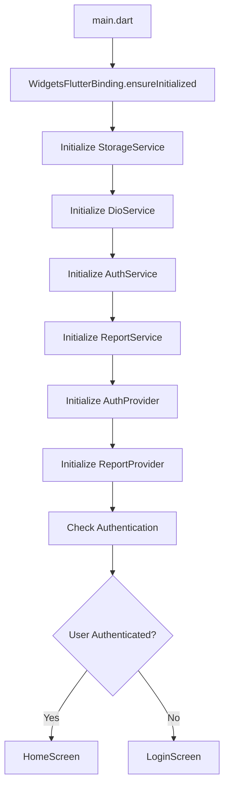
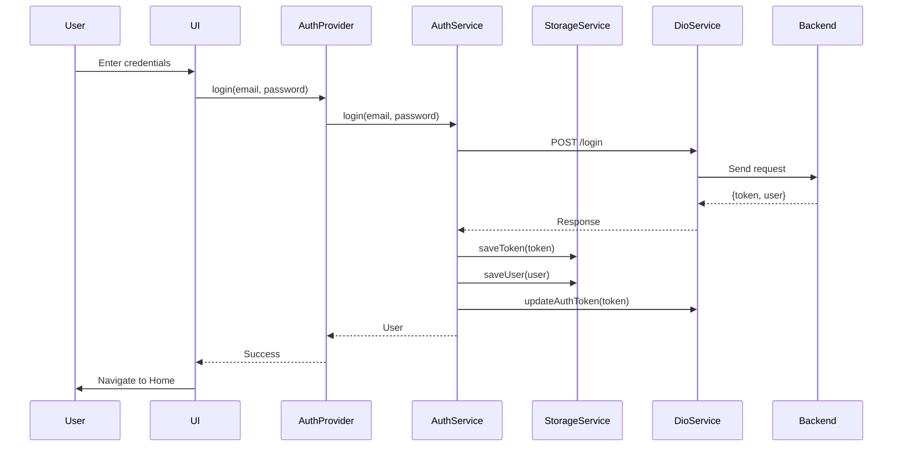
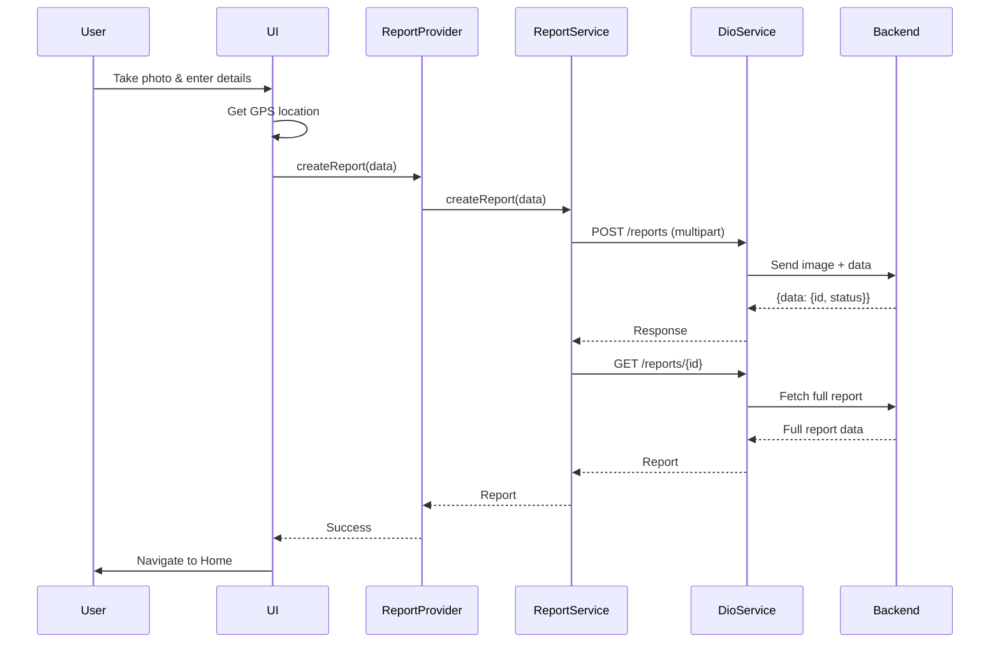
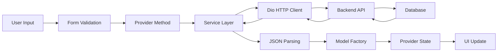

# تقرير شامل عن تطبيق Smart Damage Assessment - Flutter

## 1. شجرة الملفات الكاملة

```
smart_damage_assessment/
├── lib/
│   ├── main.dart                          # نقطة الدخول الرئيسية للتطبيق
│   │
│   ├── core/                              # التكوينات الأساسية
│   │   ├── config.dart                    # إعدادات التطبيق وعناوين URL
│   │   ├── api_constants.dart             # ثوابت نقاط النهاية للـ API
│   │   └── theme.dart                     # تنسيقات الألوان والسمات
│   │
│   ├── models/                            # نماذج البيانات
│   │   ├── report.dart                    # نموذج التقرير (Report)
│   │   └── user.dart                      # نموذج المستخدم (User)
│   │
│   ├── providers/                         # إدارة الحالة (State Management)
│   │   ├── auth_provider.dart             # مزود المصادقة
│   │   └── report_provider.dart           # مزود التقارير
│   │
│   ├── services/                          # الخدمات والمنطق التجاري
│   │   ├── dio_service.dart               # خدمة HTTP باستخدام Dio
│   │   ├── auth_service.dart              # خدمة المصادقة
│   │   ├── report_service.dart            # خدمة التقارير
│   │   └── storage_service.dart           # خدمة التخزين المحلي
│   │
│   ├── screens/                           # شاشات التطبيق
│   │   ├── splash/
│   │   │   └── splash_screen.dart         # شاشة البداية
│   │   ├── auth/
│   │   │   ├── login_screen.dart          # شاشة تسجيل الدخول
│   │   │   └── register_screen.dart       # شاشة إنشاء الحساب
│   │   ├── home/
│   │   │   └── home_screen.dart           # الشاشة الرئيسية
│   │   ├── report/
│   │   │   ├── create_report_screen.dart  # شاشة إنشاء تقرير
│   │   │   └── report_details_screen.dart # شاشة تفاصيل التقرير
│   │   └── settings/
│   │       └── settings_screen.dart       # شاشة الإعدادات
│   │
│   └── widgets/                          # مكونات واجهة المستخدم القابلة لإعادة الاستخدام
│       ├── custom_button.dart             # زر مخصص
│       ├── custom_text_field.dart         # حقل نص مخصص
│       ├── report_card.dart               # بطاقة التقرير
│       └── loading_indicator.dart         # مؤشر التحميل
│
├── android/                              # إعدادات Android
│   └── app/src/main/
│       ├── AndroidManifest.xml            # صلاحيات التطبيق
│       └── kotlin/.../MainActivity.kt     # النشاط الرئيسي
│
├── ios/                                  # إعدادات iOS
│   └── Runner/Info.plist                 # معلومات التطبيق
│
└── pubspec.yaml                          # ملف التبعيات
```

---

## 2. خوارزمية التنفيذ (Execution Flow)

### 2.1 تدفق بدء التطبيق



### 2.2 تدفق المصادقة



### 2.3 تدفق إنشاء التقرير



---

## 3. طريقة إنشاء الدوال

### 3.1 نمط Singleton للخدمات

```dart
// مثال: DioService
class DioService {
  static DioService? _instance;
  
  // منشئ خاص
  DioService._();
  
  // الحصول على المثيل الوحيد
  static Future<DioService> getInstance() async {
    if (_instance == null) {
      _instance = DioService._();
      await _instance!._init();
    }
    return _instance!;
  }
}
```

**الفوائد:**
- مثيل واحد فقط من الخدمة في جميع أنحاء التطبيق
- توفير الموارد
- سهولة الوصول من أي مكان

### 3.2 نمط Provider لإدارة الحالة

```dart
// AuthProvider - يرث من ChangeNotifier
class AuthProvider with ChangeNotifier {
  User? _user;
  bool _isLoading = false;
  
  // Getters
  User? get user => _user;
  bool get isLoading => _isLoading;
  
  // دالة تسجيل الدخول
  Future<bool> login(String email, String password) async {
    _setLoading(true);
    try {
      _user = await _authService.login(email, password);
      notifyListeners(); // إعلام المستمعين بالتغيير
      return true;
    } catch (e) {
      _setError(e.toString());
      return false;
    } finally {
      _setLoading(false);
    }
  }
}
```

**الفوائد:**
- فصل منطق الأعمال عن واجهة المستخدم
- تحديث تلقائي للواجهة عند تغير الحالة
- سهولة الاختبار

### 3.3 نمط Factory للنماذج

```dart
// نموذج Report
class Report {
  final int id;
  final ReportUser user;
  final String imageUrl;
  
  // منشئ من JSON
  factory Report.fromJson(Map<String, dynamic> json) {
    return Report(
      id: json['id'] as int,
      user: ReportUser.fromJson(json['user']),
      imageUrl: json['image_url'] as String,
      // ...
    );
  }
  
  // تحويل إلى JSON
  Map<String, dynamic> toJson() {
    return {
      'id': id,
      'user': user.toJson(),
      'image_url': imageUrl,
    };
  }
}
```

**الفوائد:**
- تحويل سهل بين JSON وكائنات Dart
- التحقق من صحة البيانات
- قابلية إعادة الاستخدام

---

## 4. التعامل مع الباك إند (Backend Integration)

### 4.1 إعداد Dio مع Interceptors

```dart
// DioService - إعداد HTTP Client
Future<void> _init() async {
  _dio = Dio(
    BaseOptions(
      baseUrl: await AppConfig.getDynamicBaseUrl(),
      connectTimeout: AppConfig.connectTimeout,
      receiveTimeout: AppConfig.receiveTimeout,
      headers: {
        ApiConstants.contentType: ApiConstants.jsonContentType,
      },
    ),
  );

  // إضافة Interceptors
  _dio.interceptors.addAll([
    _AuthInterceptor(_storageService),  // إضافة التوكن تلقائياً
    _LoggingInterceptor(),               // تسجيل الطلبات
    _ErrorInterceptor(),                 // معالجة الأخطاء
  ]);
}
```

### 4.2 Interceptor للمصادقة

```dart
class _AuthInterceptor extends Interceptor {
  @override
  void onRequest(RequestOptions options, RequestInterceptorHandler handler) async {
    // إضافة التوكن من التخزين المحلي
    final token = _storageService.getToken();
    if (token != null && token.isNotEmpty) {
      options.headers[ApiConstants.authorization] = 
        '${ApiConstants.bearer} $token';
    }
    super.onRequest(options, handler);
  }
}
```

### 4.3 معالجة الأخطاء

```dart
class _ErrorInterceptor extends Interceptor {
  @override
  void onError(DioException err, ErrorInterceptorHandler handler) {
    switch (err.type) {
      case DioExceptionType.connectionTimeout:
        throw Exception('Connection timeout');
      case DioExceptionType.badResponse:
        if (err.response?.statusCode == 401) {
          throw Exception('Unauthorized');
        } else if (err.response?.statusCode == 422) {
          // أخطاء التحقق
          final errors = err.response?.data[ApiConstants.errors];
          throw Exception(errors.values.join('\n'));
        }
        break;
    }
    super.onError(err, handler);
  }
}
```

---

## 5. تبادل البيانات مع الباك إند

### 5.1 هيكل طلب تسجيل الدخول

**طلب (Request):**
```json
POST /api/login
Content-Type: application/json

{
  "email": "user@example.com",
  "password": "password123"
}
```

**استجابة (Response):**
```json
{
  "token": "eyJ0eXAiOiJKV1QiLCJhbGc...",
  "user": {
    "id": 1,
    "name": "John Doe",
    "email": "user@example.com",
    "role": "user"
  }
}
```

### 5.2 هيكل طلب إنشاء تقرير

**طلب (Request):**
```json
POST /api/reports
Content-Type: multipart/form-data

{
  "raw_location": "Main Street",
  "raw_description": "Crack in road",
  "latitude": "33.5138",
  "longitude": "36.2765",
  "image": <binary file data>
}
```

**استجابة (Response):**
```json
{
  "data": {
    "id": 123,
    "status": "pending",
    "message": "Report submitted successfully"
  }
}
```

### 5.3 هيكل استجابة التقرير الكامل

```json
{
  "id": 123,
  "user": {
    "id": 1,
    "name": "John Doe"
  },
  "image_url": "http://backend.com/storage/reports/image.jpg",
  "location": {
    "raw": "Main Street",
    "normalized": "123 Main St, City",
    "coordinates": {
      "latitude": 33.5138,
      "longitude": 36.2765
    }
  },
  "description": {
    "raw": "Crack in road",
    "ai_analysis": "Detected road damage: medium severity"
  },
  "damage_assessment": {
    "level": "medium",
    "status": "completed"
  },
  "created_at": "2024-01-15T10:30:00Z",
  "updated_at": "2024-01-15T11:00:00Z"
}
```

### 5.4 تدفق البيانات في التطبيق



---

## 6. تصميم UI لكل واجهة

### 6.1 شاشة البداية (Splash Screen)

**المكونات:**
- خلفية بلون أساسي (Primary Color)
- أيقونة الكاميرا في مربع دائري مع ظل
- عنوان التطبيق: "Smart Damage Assessment"
- شعار فرعي: "AI-Powered Damage Reporting"
- مؤشر تحميل دائري
- نص "Initializing..."

**التنسيق:**
```dart
Scaffold(
  backgroundColor: theme.primaryColor,
  body: Center(
    child: Column(
      mainAxisAlignment: MainAxisAlignment.center,
      children: [
        Icon(Icons.camera_alt, size: 60),
        Text('Smart Damage\nAssessment'),
        Text('AI-Powered Damage Reporting'),
        LoadingIndicator(),
      ],
    ),
  ),
)
```

---

### 6.2 شاشة تسجيل الدخول (Login Screen)

**المكونات:**
- AppBar مع زر الإعدادات
- أيقونة التطبيق (80x80)
- عنوان: "Welcome Back"
- حقل البريد الإلكتروني مع أيقونة
- حقل كلمة المرور مع زر إظهار/إخفاء
- زر "Sign In"
- رابط "Don't have an account? Sign Up"
- مؤشر تحميل عند المعالجة

**التخطيط:**
```
┌─────────────────────────┐
│  Settings  Login        │
├─────────────────────────┤
│                         │
│         [Icon]          │
│                         │
│      Welcome Back       │
│  Sign in to continue    │
│                         │
│  📧 Email Address       │
│  [________________]     │
│                         │
│  🔒 Password            │
│  [________________]     │
│                         │
│   [   Sign In    ]     │
│                         │
│ Don't have account?     │
│         Sign Up         │
│                         │
└─────────────────────────┘
```

---

### 6.3 شاشة إنشاء الحساب (Register Screen)

**المكونات:**
- AppBar مع زر الرجوع
- أيقونة شخص (+)
- عنوان: "Create Account"
- حقول: Name, Email, Password, Confirm Password
- زر "Create Account"
- رابط "Already have an account? Sign In"

**التحقق:**
- الاسم: مطلوب، 2 حروف على الأقل
- البريد: مطلوب، تنسيق صحيح
- كلمة المرور: مطلوبة، 8 أحرف على الأقل
- تأكيد كلمة المرور: يجب أن يتطابق

---

### 6.4 الشاشة الرئيسية (Home Screen)

**المكونات:**
- AppBar مع زر Logout
- قائمة التقارير (ListView)
- بطاقة لكل تقرير (ReportCard)
- زر عائم (FAB) لإنشاء تقرير جديد
- حالة فارغة عند عدم وجود تقارير

**بطاقة التقرير (ReportCard):**
```
┌─────────────────────────────────────┐
│ [Image]  Main Street          →   │
│          AI: Road damage...        │
│          [Pending]  15/01/2024     │
└─────────────────────────────────────┘
```

---

### 6.5 شاشة إنشاء تقرير (Create Report Screen)

**المكونات:**
- AppBar: "Create Report"
- حقل اسم الموقع (مطلوب)
- حقل الملاحظات (اختياري)
- قسم الموقع:
  - زر "Get Current Location"
  - عرض الإحداثيات عند الحصول عليها
- قسم الصورة:
  - زر "Take Photo"
  - معاينة الصورة
- زر "Submit Report"
- زر "Cancel"

**التدفق:**
1. المستخدم يدخل اسم الموقع
2. يضغط "Get Current Location" للحصول على GPS
3. يضغط "Take Photo" لالتقاط صورة
4. يضغط "Submit Report" لإرسال البيانات

---

### 6.6 شاشة تفاصيل التقرير (Report Details Screen)

**المكونات:**
- AppBar: "Report Details"
- صورة التقرير (250px height)
- شارة الحالة (Status Badge)
- أقسام المعلومات:
  - Basic Information
  - Description
  - Damage Assessment

**مثال العرض:**
```
┌─────────────────────────┐
│  Report Details         │
├─────────────────────────┤
│   [Image 250px]         │
│                         │
│   [Completed]            │
│                         │
│ ┌─────────────────────┐ │
│ │ Basic Information    │ │
│ │ Location: Main St   │ │
│ │ Date: 15/01/2024    │ │
│ │ Coordinates: 33.5...│ │
│ └─────────────────────┘ │
│                         │
│ ┌─────────────────────┐ │
│ │ Description          │ │
│ │ User: Crack...      │ │
│ │ AI: Road damage...  │ │
│ └─────────────────────┘ │
│                         │
│ ┌─────────────────────┐ │
│ │ Damage Assessment   │ │
│ │ Level: Medium       │ │
│ │ Status: Completed   │ │
│ └─────────────────────┘ │
└─────────────────────────┘
```

---

### 6.7 شاشة الإعدادات (Settings Screen)

**المكونات:**
- AppBar: "الإعدادات"
- بطاقة معلومات
- حقول الإدخال:
  - عنوان IP (مثال: 192.168.43.19)
  - رقم المنفذ (مثال: 8000)
  - المسار (مثال: /api)
- معاينة عنوان URL الكامل
- أزرار:
  - حفظ الإعدادات
  - اختبار الاتصال
  - إعادة تعيين

**التحقق:**
- IP: تنسيق صحيح (xxx.xxx.xxx.xxx)
- Port: رقم بين 1-65535
- Path: يبدأ بـ /

---

## 7. الألوان والسمات

### 7.1 نظام الألوان

```dart
// الألوان الأساسية
primaryColor:     #1976D2  (أزرق)
secondaryColor:   #DC3545  (أحمر)
accentColor:      #FFC107  (أصفر)
backgroundColor:  #F5F5F5  (رمادي فاتح)
surfaceColor:     #FFFFFF  (أبيض)
errorColor:       #D32F2F  (أحمر داكن)
successColor:     #388E3C  (أخضر)

// ألوان حالة التقرير
statusPending:    #FF9800  (برتقالي)
statusProcessed:  #4CAF50  (أخضر)
statusFailed:     #F44336  (أحمر)

// ألوان مستوى الضرر
damageLow:        #4CAF50  (أخضر)
damageMedium:     #FF9800  (برتقالي)
damageHigh:       #FF5722  (برتقالي داكن)
damageCritical:   #F44336  (أحمر)
```

### 7.2 تنسيق النصوص

```dart
headlineLarge:    32px, Bold
headlineMedium:  28px, Bold
headlineSmall:   24px, SemiBold
titleLarge:      20px, SemiBold
titleMedium:     16px, Medium
bodyLarge:       16px, Regular
bodyMedium:      14px, Regular
```

---

## 8. التبعيات الرئيسية

```yaml
dependencies:
  flutter:
    sdk: flutter
  
  # State Management
  provider: ^6.0.0
  
  # HTTP Client
  dio: ^5.0.0
  
  # Local Storage
  shared_preferences: ^2.0.0
  
  # Image Handling
  image_picker: ^1.0.0
  
  # Location Services
  geolocator: ^10.0.0
  
  # Permissions
  permission_handler: ^11.0.0
```

---

## 9. خلاصة البنية المعمارية

التطبيق يتبع نمط **MVVM** مع استخدام **Provider** لإدارة الحالة:

1. **Models**: [`report.dart`](lib/models/report.dart), [`user.dart`](lib/models/user.dart) - تمثل البيانات
2. **View**: جميع الشاشات في [`screens/`](lib/screens/) - واجهة المستخدم
3. **ViewModel**: [`auth_provider.dart`](lib/providers/auth_provider.dart), [`report_provider.dart`](lib/providers/report_provider.dart) - منطق الأعمال
4. **Services**: [`dio_service.dart`](lib/services/dio_service.dart), [`auth_service.dart`](lib/services/auth_service.dart), [`report_service.dart`](lib/services/report_service.dart) - الاتصال بالباك إند

هذه البنية تضمن:
- **فصل المسؤوليات** (Separation of Concerns)
- **قابلية الاختبار** (Testability)
- **قابلية الصيانة** (Maintainability)
- **قابلية التوسع** (Scalability)

---

## 10. أوامر Flutter المهمة

### التطوير
```bash
flutter pub get                    # تثبيت التبعيات
flutter run                        # تشغيل التطبيق
flutter build apk                  # بناء APK
flutter build appbundle            # بناء App Bundle
```

### جودة الكود
```bash
dart format .                     # تنسيق الكود
flutter analyze                   # تحليل الكود
flutter test                      # تشغيل الاختبارات
flutter test --coverage           # اختبارات مع التغطية
```

### الأجهزة
- Android Emulator: `http://10.0.2.2:8000/api`
- Physical Device: `http://<PC_IP>:8000/api`
- iOS Simulator: `http://127.0.0.1:8000/api`

---

**تم إنشاء هذا التقرير بواسطة Kilo Code**
**التاريخ:** 2026-01-27
